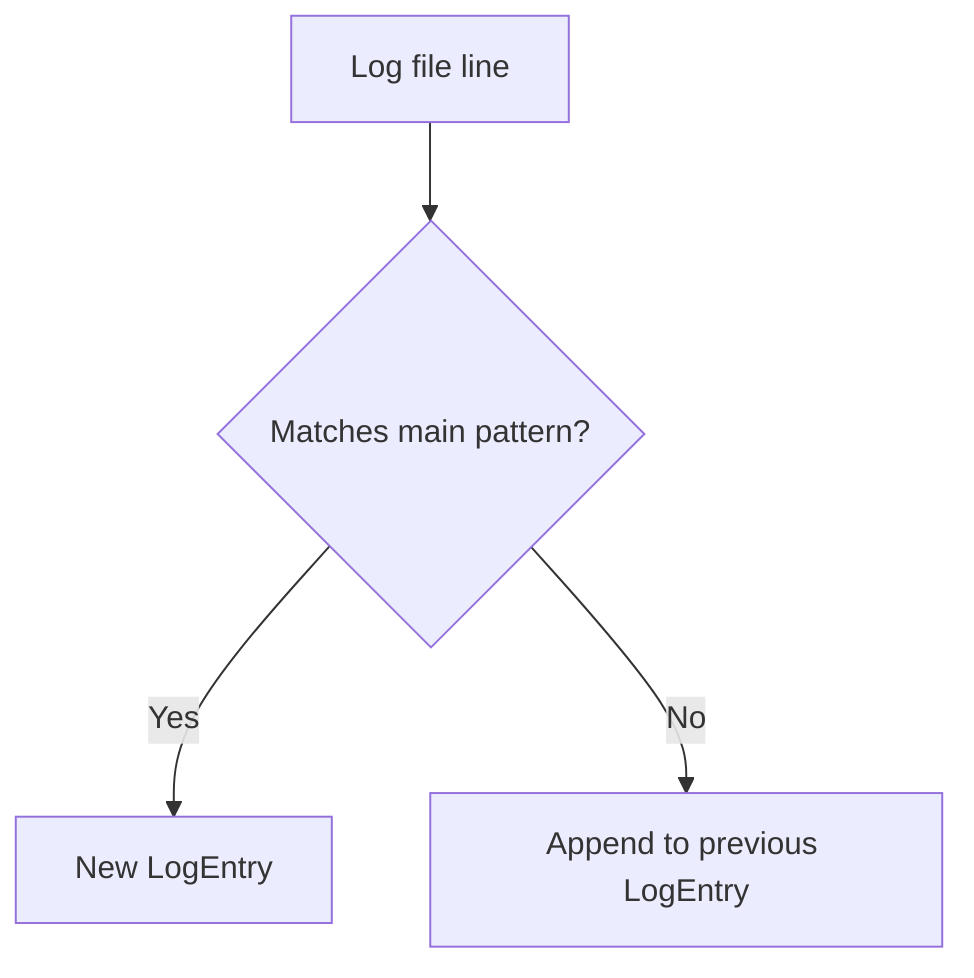

# AI Assistant Context - Smart Dev Dashboard

## 🎯 Quick Reference for AI Assistant

**ALWAYS READ THIS BEFORE MAKING CHANGES OR SUGGESTIONS**

### Project Identity

- **Name**: Smart Dev Dashboard
- **Purpose**: AI-powered log analysis and debugging assistance
- **Type**: Internal development tool
- **Scale**: Small team (2-5 users), scalable architecture

### MVP Priorities (Current Focus)

1. **AI Log Analysis** - GPT-4 powered analysis with error summaries
2. **Vector Search (FAISS)** - Fast similarity search for similar incidents
3. **Automated Testing** - Comprehensive Pytest suite
4. **CI/CD Pipeline** - GitHub Actions + Docker automation

### Target Users

- **Primary**: Development teams (backend/devops)
- **Secondary**: Tech leads, QA teams
- **Use Case**: Quick debugging assistance during incident response

### Tech Stack

- **Backend**: FastAPI (Python 3.13)
- **AI**: OpenAI GPT-4 API
- **Search**: FAISS vector similarity
- **Container**: Docker & Docker Compose
- **CI/CD**: GitHub Actions
- **Testing**: pytest + httpx

### Current Status

- ✅ Basic FastAPI structure
- ✅ OpenAI integration
- ✅ Docker setup
- ✅ CI/CD pipeline
- ✅ Vector search implementation
- ✅ Web dashboard UI
- ✅ Full CRUD for logs and log entries (SQLModel + SQLite)
- ✅ Robust, safe logging (loguru, no KeyError)
- Log parser supports both classic (YYYY-MM-DD HH:MM:SS [LEVEL] source:function:line - message) and ISO (YYYY-MM-DDTHH:MM:SS.sssZ [LEVEL] message with stack trace) formats. Stack traces are attached to the previous log entry.

### Key Constraints

- **Language**: Polish (primary), English (fallback)
- **Deployment**: Local server, Azure, or VPS
- **Security**: Internal tool, no public access needed
- **Performance**: Fast response times for debugging scenarios

### Development Guidelines

- Follow PEP 8 standards
- Use type hints
- Comprehensive testing
- Clear error messages
- Modular architecture

### Important Files

- `PROJECT_SPEC.md` - Complete project specification
- `app/main.py` - FastAPI application entry point
- `app/services/gpt_service.py` - OpenAI integration
- `app/api/analyze.py` - Log analysis endpoint
- `requirements.txt` - Dependencies

### Next Steps (MVP)

1. Enhance error handling and validation
2. Improve test coverage
3. Add structured logging

### Example supported log lines:

- Classic: 2024-07-05 16:12:34 [ERROR] database:connect_db:42 - Database connection failed: timeout after 30s
- ISO: 2025-07-05T12:01:32.751Z [ERROR] Send email error: ... (with stack trace indented)

### Log parsing flow:

---

**Remember**: This is an MVP focused on providing quick, AI-powered debugging assistance to development teams. Keep it simple, fast, and practical.
