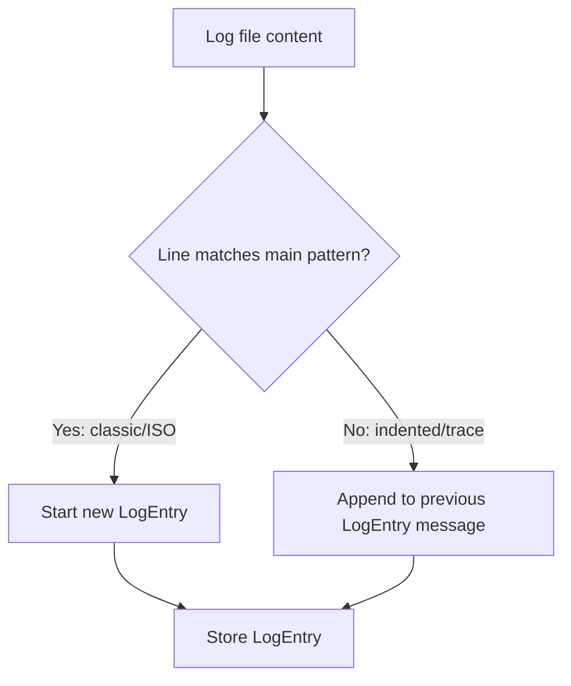

# Smart Dev Dashboard - Project Specification

## 🎯 Project Overview

**Smart Dev Dashboard** is an AI-powered development dashboard designed to help developers analyze logs, identify issues, and get intelligent suggestions for problem resolution. The system uses OpenAI's GPT models to provide contextual analysis of development logs and error messages.

## 🚀 Core Features

### MVP Features (Priority 1)

- **AI Log Analysis**: GPT-4 powered analysis with error summaries and debugging suggestions
- **Vector Search (FAISS)**: Fast similarity search for finding similar incidents and error patterns
- **Automated Testing**: Comprehensive Pytest suite for solid CI foundation
- **CI/CD Pipeline**: GitHub Actions + Docker for automated testing and deployment
- **Health Monitoring**: System status verification and monitoring

### Current Implementation

- **Log Analysis API**: AI-powered analysis of development logs using GPT-4
- **Health Check Endpoint**: System monitoring and status verification
- **RESTful API**: Clean, modular FastAPI-based architecture
- **Docker Support**: Containerized deployment with Docker and Docker Compose
- **CI/CD Pipeline**: Automated testing and deployment via GitHub Actions
- **Full CRUD for logs and log entries via SQLModel and SQLite**
- **Robust logging with loguru (no KeyError on dynamic fields)**

### Future Features (Post-MVP)

- **Real-time Log Processing**: Stream processing of live logs
- **Issue Categorization**: Automatic classification of problems by severity and type
- **Solution Database**: AI-generated recommendations for common issues
- **Dashboard UI**: Web interface for log visualization and analysis
- **Team Collaboration**: Shared analysis and comments on issues
- **Logging System Integrations**: ELK stack, Grafana Loki, CloudWatch logs

## 🏗️ Architecture

### Tech Stack

- **Backend**: FastAPI (Python 3.13)
- **AI Integration**: OpenAI GPT-4 API
- **Vector Search**: FAISS for similarity search
- **Containerization**: Docker & Docker Compose
- **Testing**: pytest with httpx for API testing
- **CI/CD**: GitHub Actions
- **Environment**: python-dotenv for configuration

### Project Structure

```
smart_dev_dashboard/
├── app/
│   ├── api/           # API endpoints and routers
│   │   ├── analyze.py # Log analysis endpoint
│   │   └── logs.py    # Logs management endpoint
│   ├── services/      # Business logic layer
│   │   ├── gpt_service.py # OpenAI integration
│   │   └── vector_service.py # FAISS vector search (planned)
│   ├── tests/         # Test suite
│   └── main.py        # FastAPI application entry point
├── .github/workflows/ # CI/CD pipelines
├── Dockerfile         # Container configuration
├── docker-compose.yml # Multi-service orchestration
└── requirements.txt   # Python dependencies
```

## 🔧 API Endpoints

### Current Endpoints

- `GET /health` - Health check endpoint
- `GET /logs` - Logs management (placeholder)
- `POST /analyze` - AI-powered log analysis
- `POST /logs_sql` - Create log file (SQLModel)
- `GET /logs_sql` - List log files
- `GET /logs_sql/{id}` - Get log file by ID
- `PUT /logs_sql/{id}` - Update log file
- `DELETE /logs_sql/{id}` - Delete log file
- `POST /log_entries_sql` - Create log entry
- `GET /log_entries_sql` - List log entries
- `GET /log_entries_sql/{id}` - Get log entry by ID
- `PUT /log_entries_sql/{id}` - Update log entry
- `DELETE /log_entries_sql/{id}` - Delete log entry

### API Specifications

```yaml
POST /analyze:
  request:
    log: string (required) - Log content to analyze
  response:
    analysis: string - AI-generated analysis and suggestions
```

## 🧠 AI Integration

### OpenAI Service

- **Model**: GPT-4o-mini (cost-effective, fast)
- **Temperature**: 0.3 (balanced creativity and consistency)
- **System Prompt**: DevOps expert role for log analysis
- **Language**: Polish (primary), English (fallback)

### Analysis Capabilities

- Error pattern recognition
- Root cause identification
- Solution recommendations
- Severity assessment
- Performance impact analysis

## 🔍 Vector Search (FAISS)

### Similarity Search Features

- **Incident Matching**: Find similar past incidents and error patterns
- **Fast Retrieval**: Efficient vector-based similarity search
- **Pattern Recognition**: Identify recurring issues across different systems
- **Historical Context**: Provide context from previous similar incidents

### Data Sources (MVP)

- **Local Log Files**: Upload via API or local file system
- **API Integration**: Direct log submission through REST endpoints
- **Future**: ELK stack, Grafana Loki, CloudWatch logs integration

## 🔗 Integrations

### Current (MVP)

- **File Upload**: Local .log files via API
- **Direct API**: Log content submission through REST endpoints

### Planned Integrations

- **ELK Stack**: Elasticsearch, Logstash, Kibana
- **Grafana Loki**: Cloud-native log aggregation
- **CloudWatch Logs**: AWS logging service
- **Custom Log Sources**: Extensible integration framework

## 🐳 Deployment

### Development

```bash
# Local development
docker-compose up app

# Run tests
docker-compose run --rm tests
```

### Production

- Containerized deployment
- Environment-based configuration
- Health monitoring
- Log aggregation

## 🧪 Testing Strategy

### Test Coverage

- **Unit Tests**: Individual component testing
- **Integration Tests**: API endpoint testing
- **Mock Testing**: External API simulation
- **Error Handling**: Edge case validation

### Test Structure

- `test_analyze.py` - Log analysis endpoint tests
- `test_health.py` - Health check tests
- `test_logs.py` - Logs endpoint tests

## 🔐 Security & Configuration

### Environment Variables

- `OPENAI_API_KEY` - OpenAI API authentication
- Additional configs for production deployment

### Security Considerations

- API key management via environment variables
- Input validation and sanitization
- Rate limiting (planned)
- Authentication/Authorization (planned)

## 📈 Future Roadmap

### Phase 1 (Current)

- ✅ Basic API structure
- ✅ OpenAI integration
- ✅ Docker setup
- ✅ CI/CD pipeline

### Phase 2 (Next)

- 🔄 Real-time log streaming
- 🔄 Issue categorization
- 🔄 Solution database
- 🔄 Performance optimization

### Phase 3 (Future)

- 📋 Web dashboard UI
- 📋 Team collaboration features
- 📋 Advanced analytics
- 📋 Third-party integrations

## 🎨 Development Guidelines

### Code Style

- Follow PEP 8 standards
- Use type hints where appropriate
- Comprehensive docstrings
- Clear error messages

### Git Workflow

- Feature branch development
- Pull request reviews
- Automated testing on push
- Semantic versioning

### Documentation

- API documentation (FastAPI auto-generated)
- Code comments and docstrings
- README updates
- Deployment guides

## 🔍 Monitoring & Observability

### Current

- Health check endpoint
- Basic logging

### Planned

- Structured logging with loguru
- Metrics collection
- Performance monitoring
- Error tracking

## 👥 Target Users & Scale

### Primary Users

1. **Development Teams** (Backend/DevOps): Quick log analysis during debugging and incident response
2. **Tech Leads**: Analysis of regression issues and build problems
3. **QA Teams**: Test failure analysis and reporting
4. **System Administrators**: Infrastructure problem diagnosis

### Project Scale

- **MVP Phase**: Small scale (1 team, 2-5 users)
- **Growth Phase**: Extended to multiple teams or external clients
- **Deployment**: Local server, Azure, or VPS with container clustering capability
- **Architecture**: Scalable backend (FastAPI + Docker) prepared for growth

## 💡 Use Cases

### Primary Use Cases

1. **Development Teams**: Quick log analysis during debugging
2. **DevOps Engineers**: Automated issue detection and resolution
3. **System Administrators**: Infrastructure problem diagnosis
4. **QA Teams**: Test failure analysis and reporting

### Example Scenarios

- Database connection failures
- API timeout issues
- Memory leaks detection
- Performance bottlenecks
- Security incident analysis

### MVP Focus

- **Internal Tool**: Supporting dev/infra teams (e.g., RM CyberShield)
- **Quick Feedback**: Fast AI-powered debugging assistance for developers
- **Incident Analysis**: Rapid identification of similar past incidents using vector search

### Data Storage

- All logs and log entries are stored in SQLite using SQLModel.
- No file-based metadata is used; all metadata is in the database.

### Log Parsing

- The backend log parser supports both classic log format (`YYYY-MM-DD HH:MM:SS [LEVEL] source:function:line - message`) and ISO format (`YYYY-MM-DDTHH:MM:SS.sssZ [LEVEL] message` with stack trace lines).
- Stack traces and indented lines are automatically attached to the previous log entry, so multi-line errors are stored as a single entry.

#### Example Supported Log Lines

Classic format:

```
2024-07-05 16:12:34 [ERROR] database:connect_db:42 - Database connection failed: timeout after 30s
2024-07-05 16:12:35 [WARN] database:connect_db:42 - Retrying connection...
```

ISO format with stack trace:

```
2025-07-05T12:01:32.751Z [ERROR] Send email error: Error: Testowy błąd loggera!
    at POST (webpack-internal:///(rsc)/./src/app/api/send/route.js:45:15)
    at process.processTicksAndRejections (node:internal/process/task_queues:95:5)
    ...
```

#### Log Parsing Flow



---

**Last Updated**: December 2024  
**Version**: 1.0.0  
**Status**: Active Development
