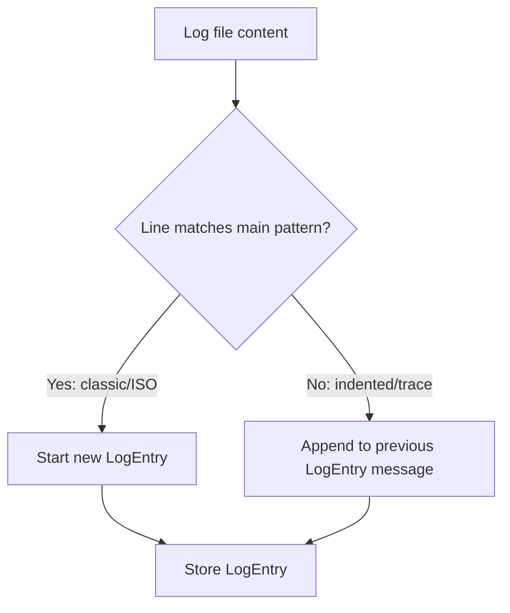

# Smart Dev Dashboard

AI-powered development dashboard for intelligent log analysis, vector search, and DevOps monitoring.

## 🚀 Project Overview

Smart Dev Dashboard is an internal tool for AI-powered log analysis, vector search, and DevOps monitoring. It helps development teams analyze logs, identify issues, and get intelligent suggestions for problem resolution.

## 🗝️ Key Features

- **AI Log Analysis** (GPT-4)
- **Vector Search (FAISS)**
- **Web UI** (log upload, search, analysis)
- **Monitoring** (Prometheus + Grafana)
- **Full CRUD for logs and log entries (SQLModel + SQLite)**
- **Modern, robust logging (loguru, safe for dynamic fields)**

## 🏁 Quick Start

## 🐳 Deployment

> **Note:** This project no longer includes an automated Azure deployment workflow. For deployment, use local, Docker, or other cloud/VPS solutions.

```bash
# Install dependencies
pip install -r requirements.txt

# Run locally
uvicorn app.main:app --reload

# Or with Docker
docker-compose up --build
```

## 🗄️ Database

- Uses **SQLite** by default (`logs.db` in project root).
- All logs and log entries are stored in the database (see `/logs_sql` and `/log_entries_sql` endpoints).
- If you change models, delete `logs.db` to recreate the schema (or use Alembic for migrations).

## 🗄️ Supported Log Formats

The log parser supports:

- **Classic format:**
  `YYYY-MM-DD HH:MM:SS [LEVEL] source:function:line - message`
- **ISO format:**
  `YYYY-MM-DDTHH:MM:SS.sssZ [LEVEL] message`
  (with stack trace lines indented below)

The parser automatically attaches stack traces and indented lines to the previous log entry's message, so multi-line errors are stored as a single entry.

## 🧑‍💻 API Usage

- **Add log:** `POST /logs_sql`
- **Get logs:** `GET /logs_sql`
- **Add log entry:** `POST /log_entries_sql`
- **Get log entries:** `GET /log_entries_sql`
- See `/docs` for full OpenAPI documentation.

**Example (Insomnia/JSON):**

```json
{
	"filename": "example.log",
	"size": 2048,
	"upload_time": "2024-07-05T15:00:00",
	"log_count": 5,
	"log_analysis_status": "pending",
	"analysis_result": null
}
```

## 📡 API Examples

### Health Check

```bash
curl -X GET http://localhost:8001/health
```

### Log Analysis

```bash
curl -X POST http://localhost:8001/analyze \
  -H "Content-Type: application/json" \
  -d '{
    "log": "ERROR: Database connection failed: timeout after 30s\nWARN: Retrying connection...\nERROR: Connection failed again"
  }'
```

### Log Files CRUD

**Create Log File:**

```bash
curl -X POST http://localhost:8001/logs_sql \
  -H "Content-Type: application/json" \
  -d '{
    "filename": "app.log",
    "size": 1024,
    "upload_time": "2024-07-05T15:00:00",
    "log_count": 10,
    "log_analysis_status": "pending",
    "analysis_result": null
  }'
```

**Get All Log Files:**

```bash
curl -X GET http://localhost:8001/logs_sql
```

**Get Log File by ID:**

```bash
curl -X GET http://localhost:8001/logs_sql/1
```

**Update Log File:**

```bash
curl -X PUT http://localhost:8001/logs_sql/1 \
  -H "Content-Type: application/json" \
  -d '{
    "filename": "app.log",
    "size": 2048,
    "upload_time": "2024-07-05T15:00:00",
    "log_count": 15,
    "log_analysis_status": "completed",
    "analysis_result": "Found 3 errors related to database connectivity"
  }'
```

**Delete Log File:**

```bash
curl -X DELETE http://localhost:8001/logs_sql/1
```

### Log Entries CRUD

**Create Log Entry:**

```bash
curl -X POST http://localhost:8001/log_entries_sql \
  -H "Content-Type: application/json" \
  -d '{
    "log_file_id": 1,
    "timestamp": "2024-07-05T15:00:00",
    "level": "ERROR",
    "message": "Database connection failed: timeout after 30s",
    "source": "database",
    "line_number": 42,
    "function_name": "connect_db"
  }'
```

**Get All Log Entries:**

```bash
curl -X GET http://localhost:8001/log_entries_sql
```

**Get Log Entry by ID:**

```bash
curl -X GET http://localhost:8001/log_entries_sql/1
```

**Update Log Entry:**

```bash
curl -X PUT http://localhost:8001/log_entries_sql/1 \
  -H "Content-Type: application/json" \
  -d '{
    "log_file_id": 1,
    "timestamp": "2024-07-05T15:00:00",
    "level": "ERROR",
    "message": "Database connection failed: timeout after 30s - RESOLVED",
    "source": "database",
    "line_number": 42,
    "function_name": "connect_db"
  }'
```

**Delete Log Entry:**

```bash
curl -X DELETE http://localhost:8001/log_entries_sql/1
```

### Vector Search

**Add Incident to Vector DB:**

```bash
curl -X POST http://localhost:8001/vector/add \
  -H "Content-Type: application/json" \
  -d '{
    "incident": "Database connection timeout after 30 seconds",
    "description": "PostgreSQL connection pool exhausted",
    "solution": "Increase max_connections and implement connection pooling"
  }'
```

**Search Similar Incidents:**

```bash
curl -X POST http://localhost:8001/vector/search \
  -H "Content-Type: application/json" \
  -d '{
    "query": "database connection timeout",
    "top_k": 5
  }'
```

### File Upload (Web UI)

**Upload Log File:**

```bash
curl -X POST http://localhost:8001/upload \
  -F "file=@/path/to/your/logfile.log"
```

### Pretty Print Responses

For readable JSON output, use `jq`:

```bash
curl -X GET http://localhost:8001/logs_sql | jq
```

Or Python's json.tool:

```bash
curl -X GET http://localhost:8001/logs_sql | python3 -m json.tool
```

## 🖥️ Web UI

- Available at [http://localhost:8001](http://localhost:8001)
- Features: log upload, AI analysis, vector search

## 🛠️ Troubleshooting

- If you change models, delete `logs.db` and restart the backend.
- All logging is robust to missing/dynamic fields (no more KeyError).
- For readable API responses, use `jq` or `python3 -m json.tool`.

## 📁 Project Structure

- `app/` – FastAPI backend, services, models, API
- `monitoring/` – Prometheus & Grafana config
- `vector_db/` – FAISS vector database
- `uploads/` – uploaded log files
- `logs/` – application logs

## 📝 Documentation

- **[PROJECT_SPEC.md](PROJECT_SPEC.md)** – Full project specification
- **API docs:** `/docs` (Swagger UI)

## 🧪 Testing

- Run tests: `pytest`
- Run tests in container: `docker-compose run --rm tests`

## 📖 Documentation

- **[PROJECT_SPEC.md](PROJECT_SPEC.md)** – Complete project specification and requirements
- API documentation: available at `/docs` when running the application

## 🔧 Development

```bash
# Install dependencies
pip install -r requirements.txt

# Run locally
uvicorn app.main:app --reload

# Run tests
pytest
```

## 🐳 Docker

```bash
# Build and run
docker-compose up --build

# Run tests in container
docker-compose run --rm tests
```

---

**For AI Assistant**: Always check `PROJECT_SPEC.md` for detailed context before making changes or suggestions.

### Example Supported Log Lines

**Classic format:**

```
2024-07-05 16:12:34 [ERROR] database:connect_db:42 - Database connection failed: timeout after 30s
2024-07-05 16:12:35 [WARN] database:connect_db:42 - Retrying connection...
```

**ISO format with stack trace:**

```
2025-07-05T12:01:32.751Z [ERROR] Send email error: Error: Testowy błąd loggera!
    at POST (webpack-internal:///(rsc)/./src/app/api/send/route.js:45:15)
    at process.processTicksAndRejections (node:internal/process/task_queues:95:5)
    ...
```

### Log Parsing Flow


